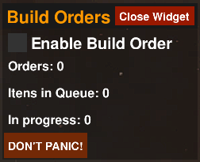

# BARBuildOrders

  

This widget stablishes a mechanism of BuildOrders which will take control of constructors units to force the construction of specific units. The code uses two list of unitDefs names: PRIORITY and ERASEABLE. Once enabled, this widget will take control of construction of PRIORITY units, and automatically call nearby nanos to reclaim on any ERASEABLE units blocking the construction.

  

### HOW TO USE

Open the code and read the "WIDGET DESCRIPTION" thing right on the beginning of the code. You can also hover over the "DON'T PANIC" label while running the widget in game.

### DISCLAIMERS

This is a work in progress, and there know issues of build orders stoping for no aparent reason. About that, there are non obvious non-bug reasons: since BuildOrders is not a native game command, a constructor unit waiting for something to be reclaimed will appear as idle in the game, which you might unintedend select to do another stuff, causing the build order to be canceled.

This widget is meant for very specific cases, where you want to construct something even if its blocked. Just enabled it when you really need this functionality.

*Technical disclaimer*: No one has yet commented on any performance issues during gameplay. Performance all depends on the amount of units being built and nanos availabe. I just encouter problems in extreme stress tests (hundreds on nanos with unreallistic range trying to attend dozens of requests). BAR Engine has a cleanup threshold of lua memory at 1.2GB, which is shared among all your widgets so: you may encounter a "cleanup sttuter", depending on your use case and which other widgets you have running.

> ⚠️ This widget **might use file reading and writing** from your computer. For clarity:
> - The Spring Engine **does not allow a widget to access files outside the widget directory** for obvious security reasons.
> - Performance wise, disk will be used only to save/load this widget configuration in a "build orders_config.txt".

> This was made with **AI assistance**, if you think this is unholy, don't use this widget.

### OUTRO
Huge thanks to Fast for testing and sharing his ideas about this widget.

Thanks to timuela and manshanko for widgets somewhat related to this one.

The widget displaying construction time on the gif is Time Estimator made by Pyrem https://github.com/Relicus/pyrem_bar_widgets, thank you.
