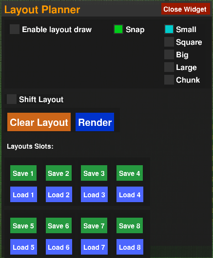
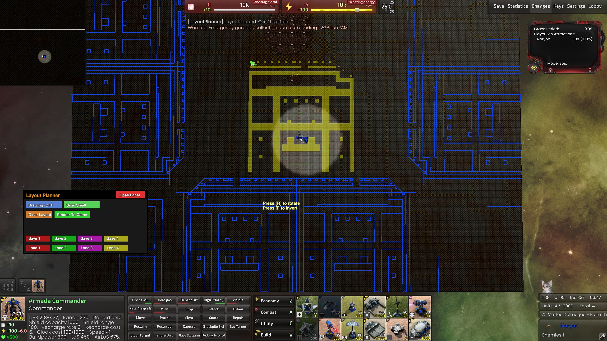
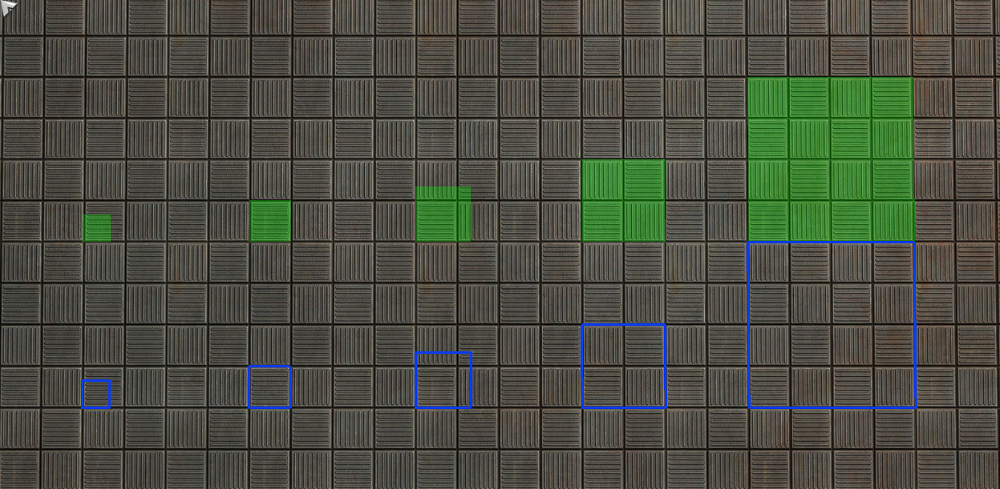
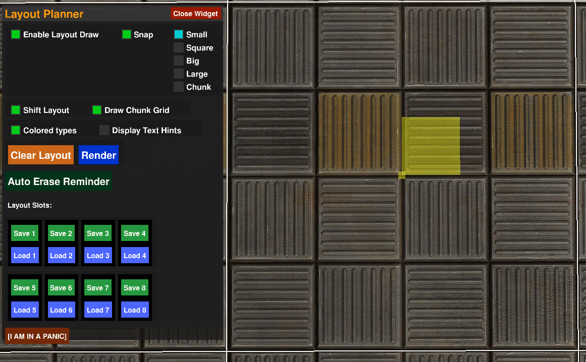

# BARLayoutPlanner

<p align="center">
  
</p>

This widget presents an interface that allows players to **draw, save, load and markup layouts** directly in-game.
<p align="center">
  
  <i>A rather complex layout (in yellow) has been loaded multiple times, rotated, inverted and placed in different places.</i>
</p>

### DISCLAIMERS
It's not a lightweight widget (by widget standards); if your computer struggles with performance — especially memory — this widget might cause some stutters; even if you have plenty of memory, this widget can reach the memory treshold allowed by Spring Engine, which force garbage collection at 1.2GB, specially while using big layouts. I don't know if the memory is shared between all widgets or just one, but either way, you've been warned.

> ⚠️ This widget **might use file reading and writing** from your computer for saving/loading layouts.  
> Please inspect the code and use the widget at your own risk. The Spring Engine (as far as I know) **does not allow a widget to access files outside the widget directory** for obvious security reasons. Performance wise, disk will be used only when a file is writen or read. If you're still suspicious, don't use this widget.  
> This was made with **AI assistance**, if you think this is unholy, don't use this widget.

### HOW TO INSTALL A WIDGET?
It is very simple, you just need a folder named Widgets inside your game folder, as such:
```[...]\Beyond-All-Reason\data\LuaUI\Widgets```
One fast way to reach there is just click with the right mouse button on you game desktop icon and go "Open folder"
Then you just copy .lua files of the widgets you want to install.
In game you can enable/disable them by name on the widget menu (press [F11] inside a game)


### HOW TO USE THE WIDGET:
To draw a layout check the "Enable Layout Draw" option. It will enable drawing layout mode. While ON, you can paint the layout using the mouse, placing building-sized units with [LMB] and place lines with [RMB]


##### Draw layout using building blocks of different sizes:

<p align="center">
  
</p>


##### Draw the layout! Save it in one of the four slots.

<p align="center">
  
</p>


##### Load the layout to place it elsewhere. You can rotate and invert the layout orientation!.

<p align="center">
  
</p>

##### Drawing Lines and erasing indidual lines

<p align="center">
  
  
</p>

--

### TIPS
- **Disable the option "Auto erase map marks"** on your Settings -> Interface, so that the lines do not disappear during the game.
- **Test solo:** Load your map alone to experiment and save your layouts; load and use them in actual matches afterward.


### OUTRO
- I used a rendering line marks technique that I saw in another widget made by Lu5ck, which split longer lines and set them to a queue to be rendered during multiple frames, this avoid long lines and drawings limit per frame. Thank you. :)
