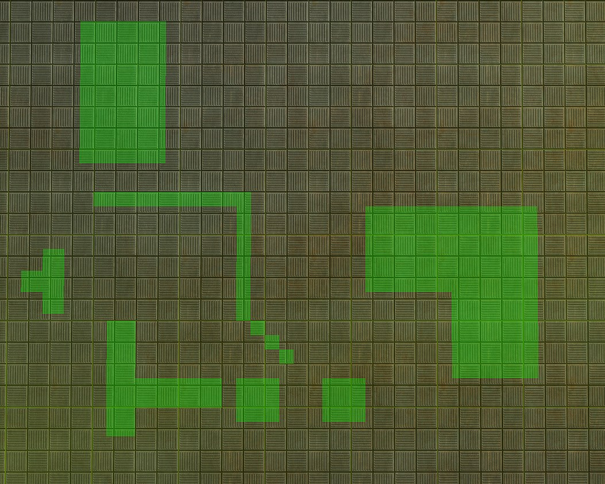
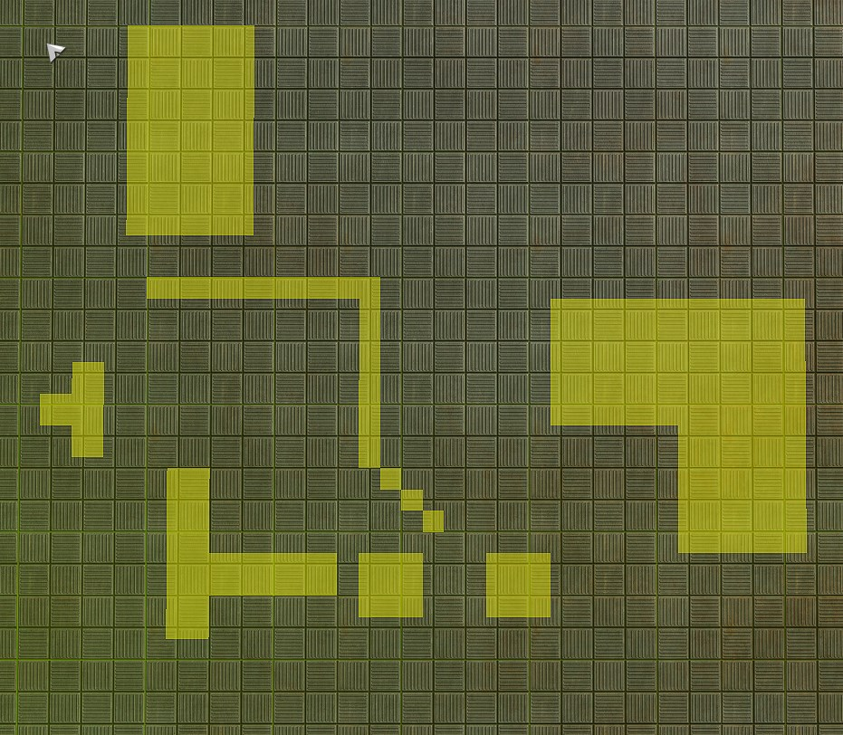
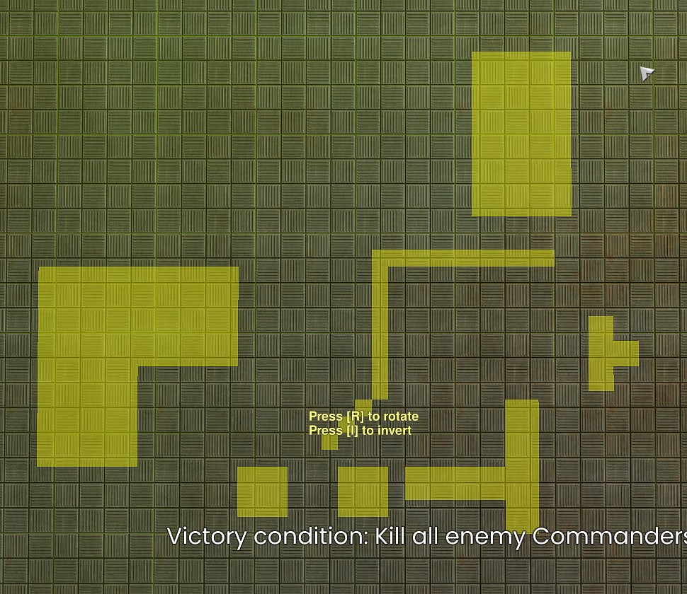
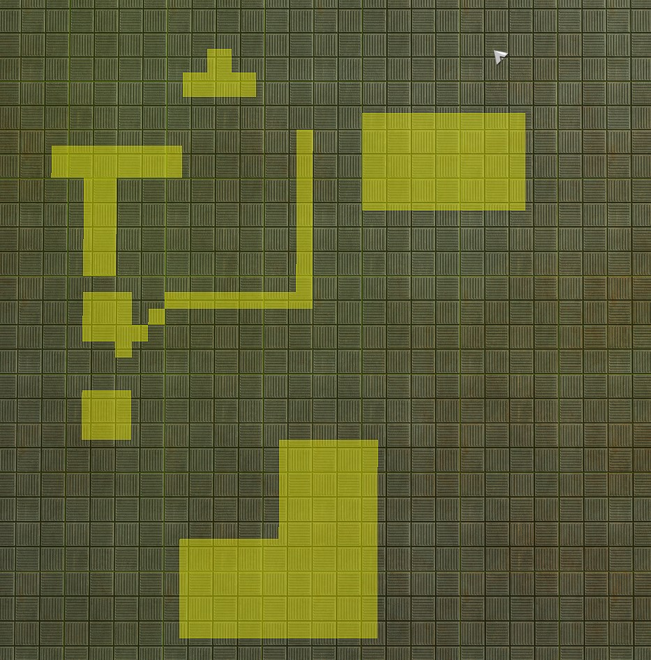
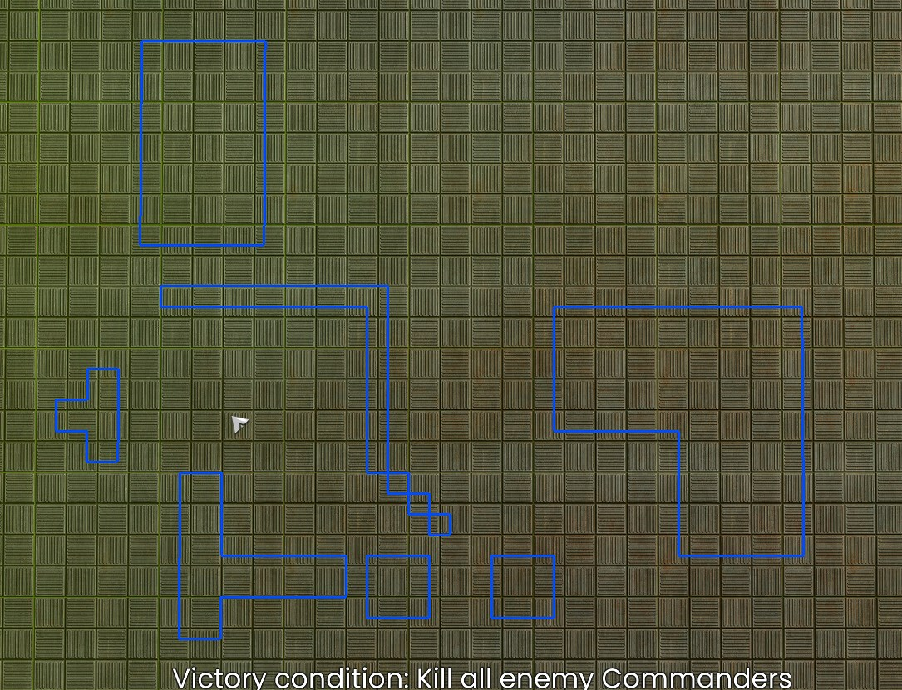
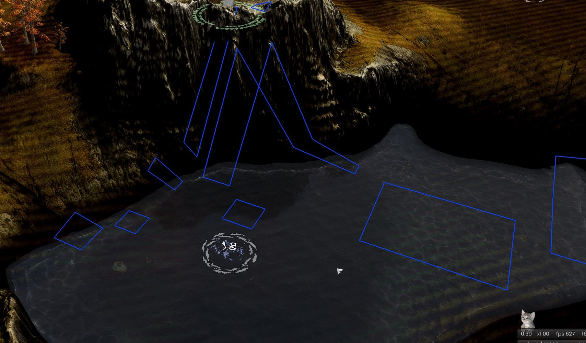

# BARLayoutPlanner

  

This widget presents an interface that allows players to **draw, save, load and markup layouts** directly in-game. The idea is that players create their layouts in advance and only load and render them at the start of the match, so that when the game starts the widget is already closed and not consuming any computer resources.

### DISCLAIMERS
It's not a lightweight widget (by widget standards); if your computer struggles with performance — especially memory — this widget might cause some stutters; even if you have plenty of memory, this widget can reach the memory treshold allowed by Spring Engine, which force garbage collection at 1.2GB! (that doesn't necessarly means the widget is using all that memory but it is occupying it, and has produced enough garbage data that needs to be released, when that happens the game might sttuter), specially while using big layouts. I don't know if the memory is shared between all widgets or just one, but either way, you've been warned.

> ⚠️ This widget **might use file reading and writing** from your computer for saving/loading layouts.  
> Please inspect the code and use the widget at your own risk. The Spring Engine (as far as I know) **does not allow a widget to access files outside the widget directory** for obvious security reasons. Performance wise, disk will be used only when a file is writen or read.
> If you're still suspicious, don't use this widget.  
> This was made with **AI assistance**, if you think this is unholy, don't use this widget.

### HOW TO USE:

- **Drawing: ON/OFF** – Enables drawing layout mode. While ON, you can paint the layout using the mouse, placing building-sized units. Use the **Size** button to change the brush/building size.
- **Size** – Changes the size of the building being added to the layout.
- **Clear Layout** – Clears the entire active layout.
- **Close Panel** – Deactivates the widget for the current game. Reactivate it through the **F11 menu**.
- **Render to Game** – Renders the current layout into the game using marker lines (like the `'` key).  
  This should be your **final step**, as the widget will shut down afterward so that it does not consume computer resources. Re-open via F11 menu if needed.
- **Save/Load Buttons** – Four slots available for saving and loading layouts.

  
  <i>A rather complex layout (in yellow) has been loaded multiple times, rotated, inverted and placed in different places.</i>

##### Draw layout using building blocks of different sizes:

  

##### Draw the layout! Save it in one of the four slots.

  

##### Load the layout to place it elsewhere.

  

##### You can also invert the layout.

  

##### You can rotate the layout (90 degrees increments).

  

##### Render the layout using line marks.

  

##### It kinda works with water and elevation differences.

  

--

### TIPS

- **Disable the option "Auto erase map marks"** on your Settings -> Interface, so that the lines do not disappear during the game.
- **Test solo:** Load your map alone to experiment and save your layouts; load and use them in actual matches afterward.
- **Use the largest brush size possible:**  
  For example, if you're filling an 8×8 square area, use **Chunk size** instead of small squares — it uses less memory and is more efficient.
- **Top-down camera helps:**  
  This widget is designed for flat maps like **Fullmetal**. It still works on maps with elevation, but previews won’t follow terrain because they're rendered as **flat XZ-plane quads**. Expect some clipping with elevation peaks and valleys (if its not what you want and know what your doing, you can disable DepthTest on render world and experiment).

--
### FUTURE?
- GUI can improve;
- Memory Performance?;
- Line resolution customization. More line resolution wraps better around elevation; (for now, if you want to experiment, on function the DrawEdges, at the line **local segments = math.ceil(dist / CHUNK_SIZE)**, use a values smaller than CHUNK_SIZE so the algorithm produces more segments)
- More save slots or dynamic approach to save/load
- Toggle button for snap to grid while drawing? (its always enabled currently)
- Toggle button for segmenting lines? (current: lines are always divided into segments; because long lines tend to glitch and flick in/out of vision)

### OUTRO
- I used a rendering line marks technique that I saw in another widget made by Lu5ck, which split longer lines and set them to a queue to be rendered during multiple frames, this avoid long lines and drawings limit per frame. Thank you. :)
